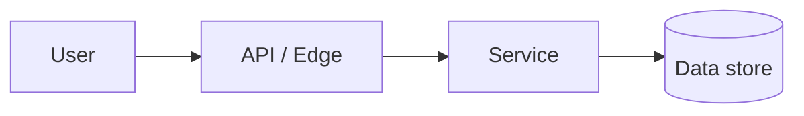

<!--
  ARCHITECTURE DOCUMENT TEMPLATE
  ----------------------------------------------------------------------------
  Produced by the Architect role from a signed-off requirement, then refined
  with the human architect until both agree. On agreement, this becomes
  docs/features/<slug>/architecture.md and is handed to the DevOps role.

  Target cloud: AWS. Prefer managed/serverless services unless the requirement
  dictates otherwise. Keep every choice traceable to a requirement or a stated
  non-functional constraint. HTML comments are guidance and are stripped on
  conversion.
-->

# Architecture: <Feature / System Name>

## 1. Metadata

| Field | Value |
|---|---|
| Feature slug | `<kebab-case-slug>` |
| Requirement | `docs/features/<slug>/requirement.md` |
| Architect (human) | <name> |
| Created / Updated | <YYYY-MM-DD> / <YYYY-MM-DD> |
| Status | `Draft` <!-- Draft → In Review → Agreed --> |
| Jira task | <KEY-123> |
| AWS account / region(s) | <target account · region(s), or "TBD with DevOps"> |

## 2. Architecture Decision

<!-- The Architect's explicit call. If "not needed", justify and stop here. -->
- **Is new or changed architecture required?** `<Yes / No>`
- **Rationale:** 
- **Scope of change:** `<New system / Extends existing / Config-only>`

## 3. Context & Requirement Summary

<!-- 3-5 sentences: what the system must do, drawn from the requirement. -->

## 4. Solution Overview

<!-- Narrative of the chosen design and why it satisfies the requirement. -->

## 5. Architecture Diagram

<!-- Mermaid or a linked diagram. Show the main components and data flow. -->

## 6. AWS Services & Components

| Component | AWS service | Purpose | Key config / notes |
|---|---|---|---|
|  |  |  |  |

## 7. Data & Storage

<!-- Data model, storage choices, retention, backups, migrations. -->

## 8. Integrations & APIs

<!-- Internal/external systems, contracts, auth, sync vs async, events. -->

## 9. Security & Compliance

| Aspect | Approach |
|---|---|
| Identity & access (IAM) |  |
| Encryption (at rest / in transit) |  |
| Network (VPC, subnets, SG, public exposure) |  |
| Secrets management |  |
| PII / GDPR / data residency |  |
| Contractual / DRM constraints |  |

## 10. Scalability, Availability & Performance

<!-- Expected load, autoscaling, multi-AZ/region, SLA/SLO, failover. -->

## 11. Observability

<!-- Logs, metrics, traces, dashboards, alarms, on-call signals. -->

## 12. Cost Considerations

<!-- Rough cost drivers and a ballpark estimate; note the main levers. -->

## 13. Alternatives Considered (ADR)

| Option | Pros | Cons | Chosen? |
|---|---|---|---|
|  |  |  |  |

## 14. Risks & Assumptions

- **Assumption:** 
- **Risk / mitigation:** 

## 15. Impact on Existing Architecture (delta)

<!-- For features entering an existing system: what changes, what stays, what
     must be migrated or deprecated. "N/A — greenfield" if new. -->

## 16. Open Questions

| # | Question | Raised by | Answer | Status |
|---|---|---|---|---|
| Q-1 |  |  |  | Open |

## 17. Agreement / Sign-Off

<!-- Set Status to "Agreed" only when the human architect and the Architect role
     both confirm. This gates the DevOps role. -->
| Party | Name | Decision | Date |
|---|---|---|---|
| Human architect |  | ☐ Agreed |  |
| Architect role (AI) | product-pipeline | ☐ Agreed |  |
